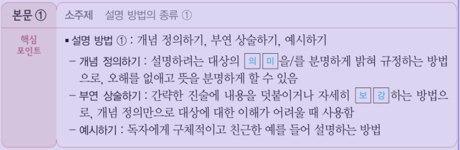
- ①, -는 제외하고 의미, □는 빼고 의미, 보강으로 대체
 
 

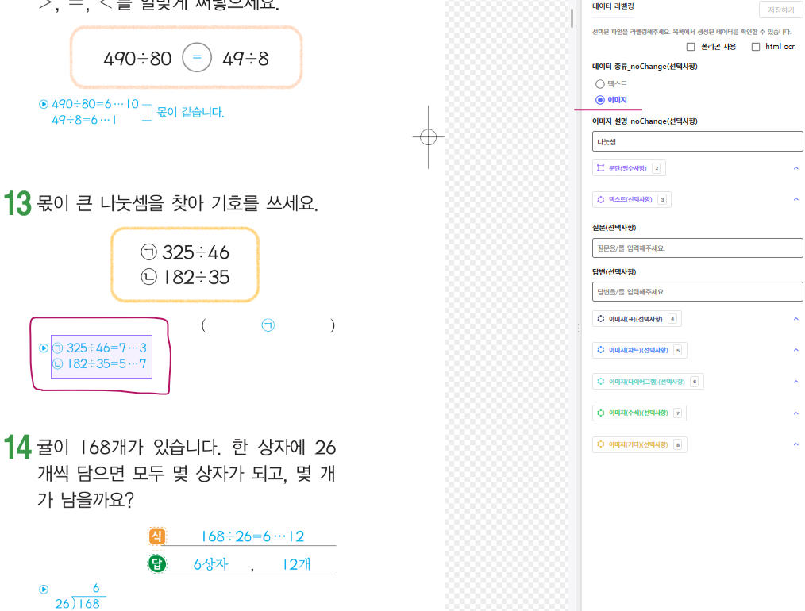
- 이미지(수식) 이다
 
 

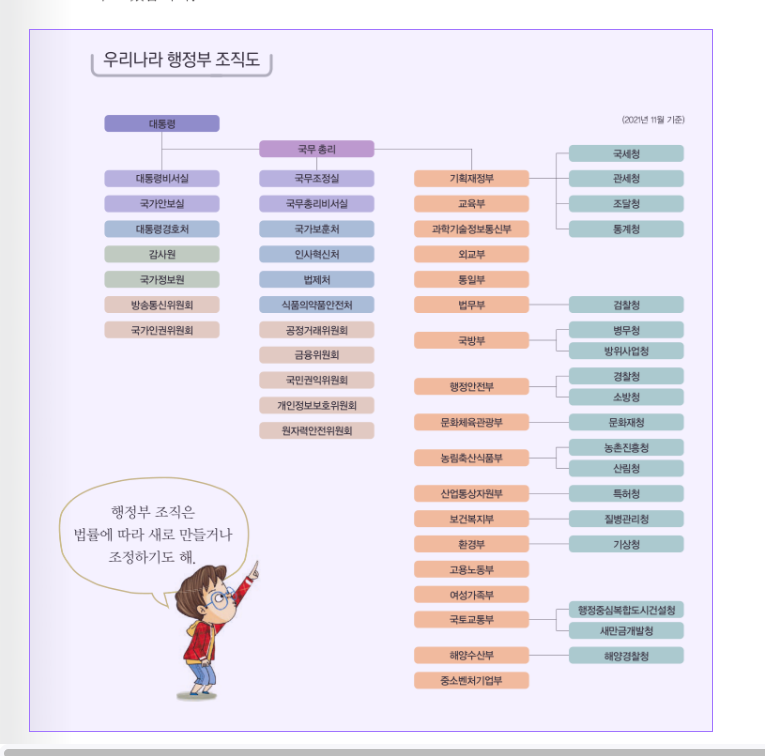
- 우리나라 행정부 조직도 이미지입니다.
대통령 산하, 대통령비서실, 국가안보실, 대통령경호처, 감사원, 국가정보원, 방송통신위원회, 국가인권위원회가 있으며, 국무총리 산하에 국무조정실, 국무총리비서실, 국가보훈처, 인사혁신처, 법제처, 식품의약품안전처, 공정거래위원회, 금융위원회, 국민권익위원회, 개인정보보호위원회, 원자력안전위원회가 있습니다.
그 외에 국세청, 관세청, 조달청, 통계청 위에 있는 기획재정부, 교육부, 과학기술정보통신부, 외교부, 통일부가 있으며, 법무부 산하에 검찰청, 국방부 산하에는 병무청과 방위사업청, 행정안전부 산하에 경찰청과 소방청, 문화체육관광부 산하 문화재청, 농림축산식품부 산하 농촌진흥청과 산림청, 산업통상지원부 산하 특허청, 보건복지부 산하 질병관리청, 환경부 산하 기상청, 고용노동부, 여성가족부, 국토교통부 산하 행정중심복합도시건설청과 새만금개발청, 해양수산부 산하 해양경찰청, 중소벤처기업부가 있습니다.
행정부 조직은 법률에 따라 새로 만들거나 조정하기도 합니다.
  이런식으로 이미지에대해 디테일하게 설명
 
 

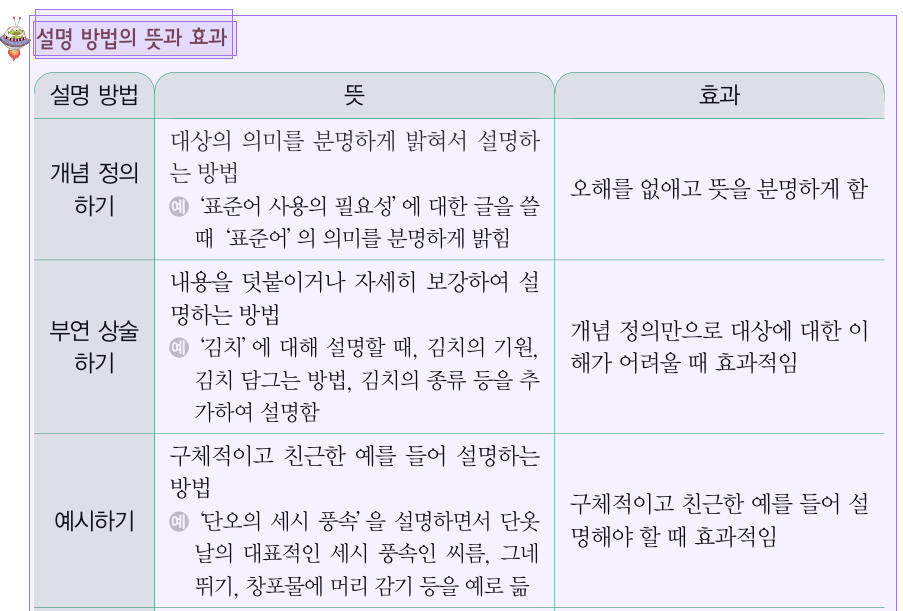
- 동그라미 쳐진 예, 해, 문항번호(1, 2, 3,..), 풀이 이런부분은 삭제하고 진행
 
 

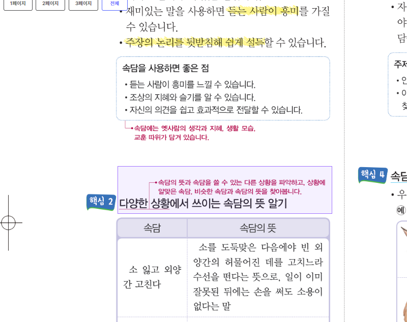
- 다양한 상황(속담의 뜻과 속담을 쓸 수 있는...)에서 쓰이는 속담의 뜻 알기
단어나 문장등을 설명하는 주석은 괄호로 넣어주기
 
 

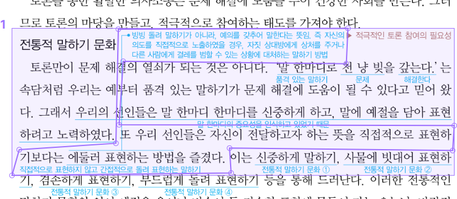
- 빙빙 돌려 말하기..., 또 우리 선인들은..., 직접적으로 표현하지 않고.. bbox 세개로 작업
 
 

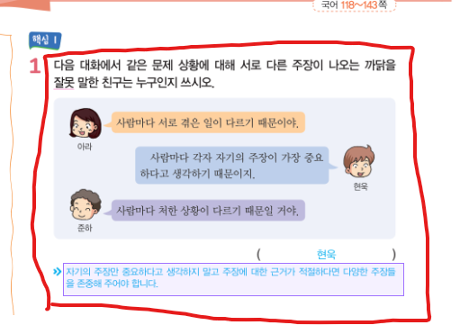
- 밑에 파란 글씨만 문단으로 가공
 
 

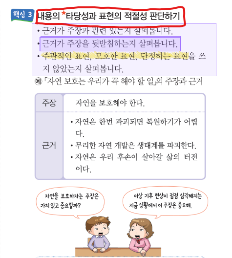
- 빨간 네모만 따로 문단으로 가공

- 이미지(기타) 0부터 1까지 12로 나눈것 중 3칸이 채워져 있으면 1/4, 6칸이채워져있으면 2/4, 9칸이 채워져있으면 3/4이다.

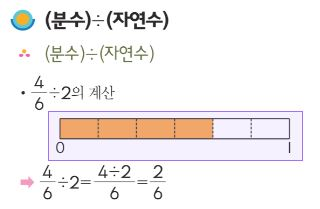
- 0부터 1까지 6등분한 칸에서 네칸까지 채워진 이미지이다.

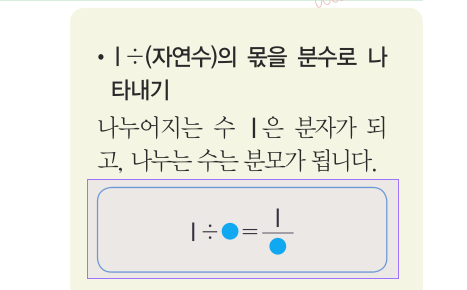
- 나누셈을 분수로 나타낸것을 설명하는 이미지이다.
1÷○ = 1/○ 이다

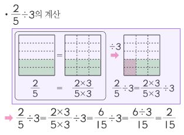
- 2/5는 (2x3)/(5x3)과 같으며, 이를 3으로 나누는것을 표현한 이미지이다.
2/5 ÷ 3 = (2x3)/(5x3) ÷ 3 이며, 이를 그림으로 표현하자면, 5칸중 2칸이 칠해져있는것을 전체 3줄로 나누어도 15칸으로 만들면 15칸중 6칸이 색칠되어있다. 이후 3줄중에서 1줄만 빗금을 치면 색칠된것중에 빗금이 쳐진것은 15칸중 2칸이 된다.

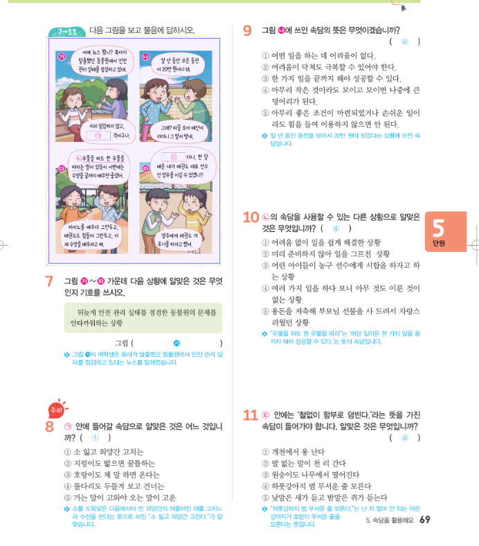
- 정답은 있지만 한 문단이 아니라서 재작업 요청

- 20.72에서 3.7을 나눈 몫이 5.6임을 나타내는 이미지이다.

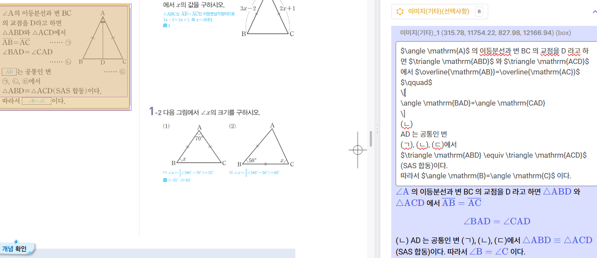
- ab=ac를 한줄 내리고  옆에 (ㄱ)임을 표시해주고 ㄴ, ㄷ도 표시해야할듯

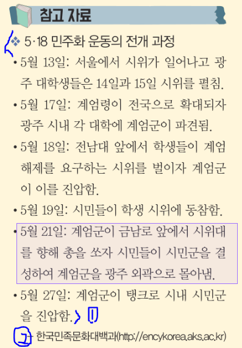
- 출처 빼고 5.18 민주화 운동의 전개과정부터 진압까지

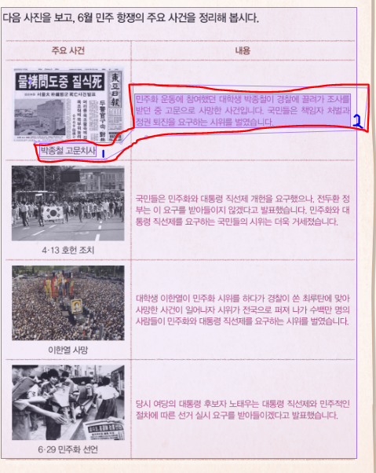
- 박종철 고문치사, 본문을 각각 bbox로 감싸야할듯
